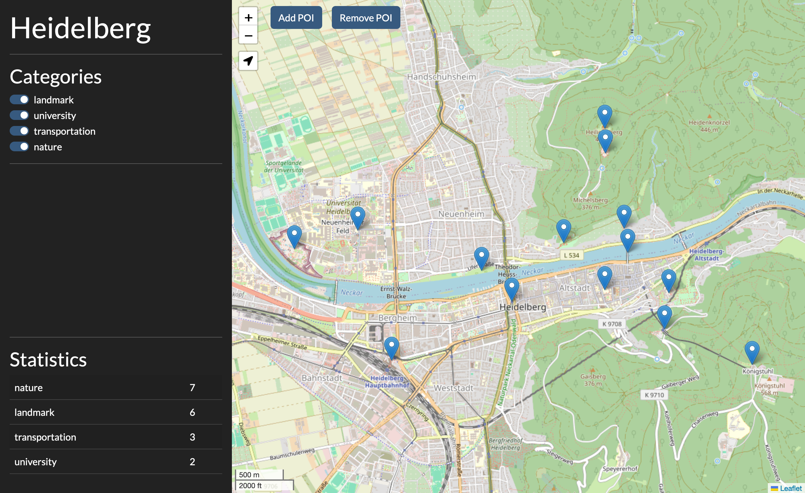

[](https://github.com/GiantMolecularCloud/poi-map/actions/workflows/code-quality.yaml)
[](https://github.com/GiantMolecularCloud/poi-map/actions/workflows/unit-tests.yaml)
[](https://github.com/GiantMolecularCloud/poi-map/actions/workflows/build-image.yml)

# POI map

A simple app to keep track of and display points-of-interest.
I needed a simple tool for POIs but did not want to use Google Maps and create a custom map there, so instead I wrote my own. The app runs on [Dash](https://dash.plotly.com/), [Dash Leaflet](https://www.dash-leaflet.com/) and uses OpenStreetMap for the map data.




Functionality:
- create, delete, update POIs
- display POIs on an interactive map
- filter POIs by categories
- get some basic POI statistics

## Running the app

### Local execution

-   (if necessary) Install [Poetry](https://python-poetry.org/): see [Poetry installation](https://python-poetry.org/docs/#installation)
-   Install the project: `poetry install`
-   Copy the demo config file from `tests/test-data/config.json` and customize it.
-   Run the map: `poetry run poi-map customized_config.json`
-   If your default browser does not open automatically, open the app at `127.0.0.1:8080`

### docker

-   Build the image: `docker build -t poi-map:latest -f docker/Dockerfile .`
-   Customize the config file in `tests/test-data/docker/config.json` and save it as `config.json`.
-   Run the container: `docker run -v /path/to/your/config/directory:/config poi-map:latest poi-map`

Built docker images are also available on [Docker Hub](https://hub.docker.com/r/giantmolecularcloud/poi-map).

### Options

Options for the application itself, the InfluxDB connection and all connected devices are configured using a config file.
The docker image assumes that this file is called `config.yaml` but for local execution the name can be whatever.

#### Example

A minimal example of the config can look like this:

```json
{
    "title": "Heidelberg",
    "database": "tests/test-data/poi.parquet",
    "categories": ["landmark", "university", "transportation", "nature"]
}
```

#### Available settings

Aside from the three basic settings, further details can be set.

| config     | default | explanation                                              |
| ---------- | ------- | -------------------------------------------------------- |
| title      |         | Title of the app that is displayed in the sidebar.       |
| databse    |         | Path to the database file. This must be a .parquet file. |
| categories |         | List of POI categories to use.                           |
| zoomlevel  | 5       | Initial zoom level of the OpenStreetMap map.             |
| port       | 8080    | Port to run the application on.                          |
| loglevel   | INFO    | Level at which messages should be logged.                |


## Development

This package is developed using [poetry](https://python-poetry.org/) which manages the development environment and
python virtualenv for you. It is also used for dependency management, as a development script runner, and packaging.

### Initial setup

1. Install a python interpreter for `python >= 3.12`. [pyenv](https://github.com/pyenv/pyenv) is a good choice to do this.
2. Install [poetry](https://python-poetry.org/) (=>1.2.0) globally (i.e. not in a project virtualenv).
3. Run `poetry install` in the project root to create a virtualenv and install all development dependencies.
4. Run `poetry run pre-commit install` in the project root. This will install [git hooks](https://git-scm.com/docs/githooks) to enforce certain code quality requirements prior to comitting changes to git.

### Development Cycle

During the development process, the code should be linted and type checked. This can be achieved using the following commands:

- For formatting & import sorting: `poetry run poe format`
- For linting: `poetry run poe lint`
- For type checking: `poetry run poe mypy`
- For testing: `poetry run poe test`
- To build the documentation: `poetry run poe docs` (Meaningful ocumentation is not yet included but is TBD.)

Each of these steps should be performed prior to creating a pull request. They can be executed all-at-once by executing
```shell
$ poetry run poe precommit
```

## To Do

- More tests that actually test something rather than just a smoke test.
- Use gunicorn or uWSGI instead of Flask's default werkzeug for better performance/security (although this is not actually needed for such a small and simple project).
- Custom markers for each category that replace the default marker.
- Populate the documentation and deploy it to a GitHub pages page.
- Add filter for date additionally to category.
